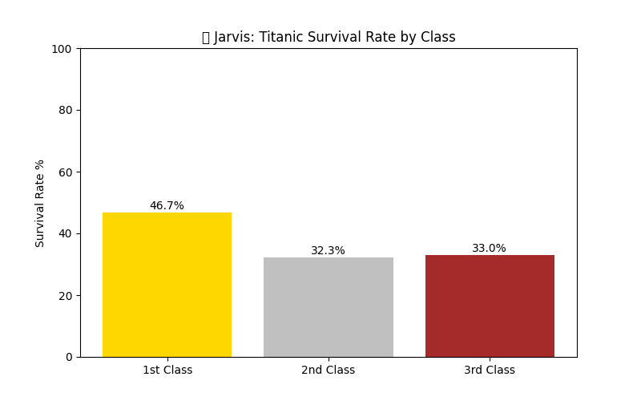

# 🤖 Jarvis: NumPy Data Analyzer

> Week 2 of 32 | AI Engineering & Jarvis Roadmap

## 🚀 Project Overview
This project performs data analysis on the Titanic dataset 
using **pure NumPy** — no Pandas, no shortcuts.
The goal was to understand how data pipelines work at 
the lowest level before moving to higher level libraries.

---

## 📊 Key Findings
| Metric | Value |
|--------|-------|
| Total Passengers | 418 |
| Overall Survival Rate | 36.36% |
| 1st Class Survival | 46.73% |
| 2nd Class Survival | 32.26% |
| 3rd Class Survival | 33.03% |

> 💡 Money bought survival — 1st class survived at nearly 
> double the rate of 3rd class passengers.

---

## 🧠 What I Learned
- NumPy array creation, indexing, slicing, reshaping
- Broadcasting — applying operations across entire arrays
- Vectorization — no loops needed
- Boolean indexing — filtering data by condition
- Handling NaN values with `nanmean`, `nanmin`, `nanmax`
- Dot product and matrix multiplication from scratch
- Matplotlib bar charts and saving visualizations

---

## 🐛 Real Problem I Solved
The Titanic CSV has a Name column with commas inside 
names like `"Braund, Mr. Owen"` which shifts all column 
indexes when parsed with NumPy's `genfromtxt`.

**Fix:** Used `usecols` parameter to load only numeric 
columns, avoiding the text parsing issue entirely.

This is exactly why Pandas was invented — but understanding 
the raw problem makes you a better engineer.

---

## 🛠️ Tech Used
- Python 3.10
- NumPy
- Matplotlib

---

## 🤖 Jarvis Feature
```python
def jarvis_array_helper(data):
    print(f"Mean: {np.mean(data)}")
    print(f"Max: {np.max(data)}")
    print(f"Shape: {data.shape}")
    print(f"Dot with itself: {np.dot(data, data)}")
```
Jarvis can now analyze any array instantly. 
This is the foundation for future ML features.

---

## 📈 Visualization


---

## 🗺️ Part of My 32-Week Journey
| Week | Topic | Status |
|------|-------|--------|
| Week 1 | Python + Statistics + EDA | ✅ Done |
| Week 2 | NumPy + Linear Algebra + CSS | ✅ Done |
| Week 3 | Pandas + Data Cleaning | 🔜 Next |
| Week 4 | Matplotlib + Visualization | 🔜 |